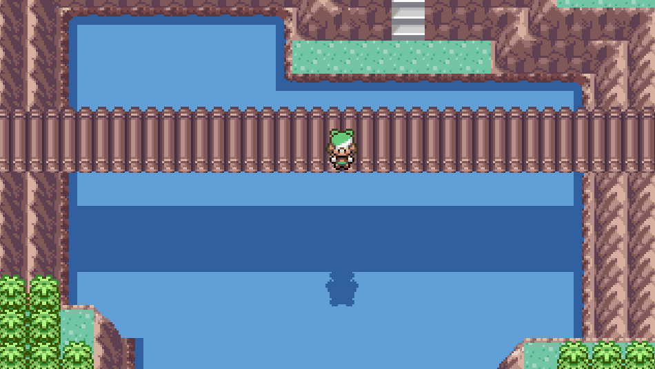
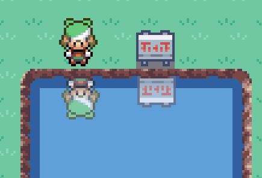

# Godot Pixel Water Reflection Shader

Shader that simulates the Pokémon Gen 3 water reflection effect. The repository contains a very basic setup for the shader.

Godot version: `v4.2.1`

Link to the shader: [https://godotshaders.com/shader/sprite-water-reflection-pixel-art/](https://godotshaders.com/shader/sprite-water-reflection-pixel-art/)

## Credits

* [Character sprite](https://www.deviantart.com/boonzeet/art/Pokemon-Arceus-Dawn-Gen-4-HGSS-Style-OW-Sprite-873387539) from [Boonzeet](https://www.deviantart.com/boonzeet)

## Media

